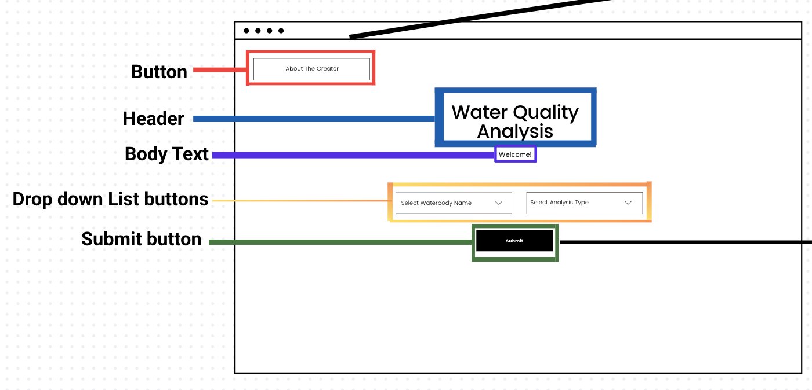
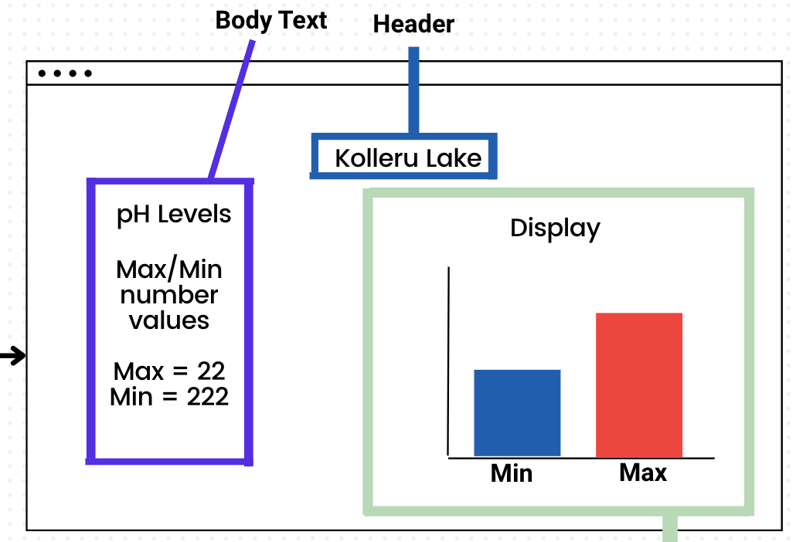
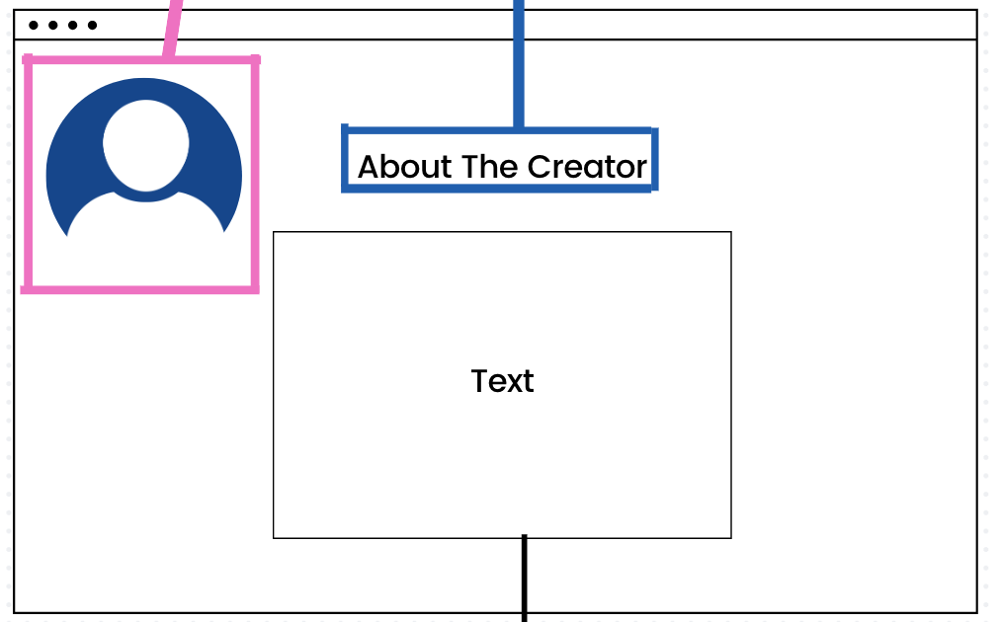

# India Water Data Analysis

Finding the water quality from a selection of waterbodies in India.

## Table of Contents
1. [Overview](#overview)
1. [Product Spec](#product-spec)

## Overview
### Description (Business Thesis)
The Water Quality Analyzer will be used by India residents to evaluate and contrast the water quality of Indian lakes and ponds.

This analysis might be useful to others to help identify different areas in India in need of water quality improvements and to aid travelers what water to not drink from or use along their journey. 

It can also be useful to researchers studying the water qualities from these bodies of water as well.

#### Customer Target
Customer Segment: Residential, Government, Industrial.

#### Problems Identified
#####  Many residents in India are unaware of the quality of their water.
* Around 35 million people lack access to safe water.
* 678 million lack access to safe sanitation.

## Product Spec
### User Stories:
###
**  Residents in India can interact with a UI to choose which data analysis and water body location they would like to pick to see the pollution levels from different bodies of water from different locations.**
* [x] Dependent dropdown menu to pick waterbody name and analysis type.
* [x] Stacked Bar Chart data analysis.
### Most Significant Benefit
#### Water Quality Analyzer will help users to identify pollution areas and track water quality trends to support environment protection and to protect the public’s health.

## Wireframes

## Schema
### Model
Below in this dataset is a measurement of the water quality at a specific station:

| Property | type | Description |
| --- | --- | --- |
| Station_code | String | Identifier for the monitoring location |
| Location | String | Station location |
| State_name | String | The State in India where the station is located |
| Waterbody_type | String | Type of waterbody |
| Temperature | Float | Water temperature |
| pH | Float | pH level of water |
| Conductivity | Float | Conductivity levels |
| BOD | Float | Biological Oxygen Demand levels (mg/L) |
| Dissolved_Oxygen | Float | Dissolved oxygen levels (mg/L) |
| Nitrate_nitrite | Float | Concentration levels (mg/L) |
| Fecal_coliform | Float | Fecal colifrom count (MPN/100mL) |
| Total_coliform | Float | Total coliform count (MPN/100mL) |

